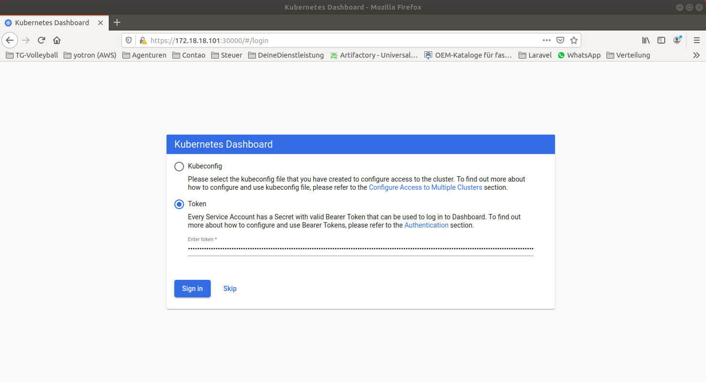
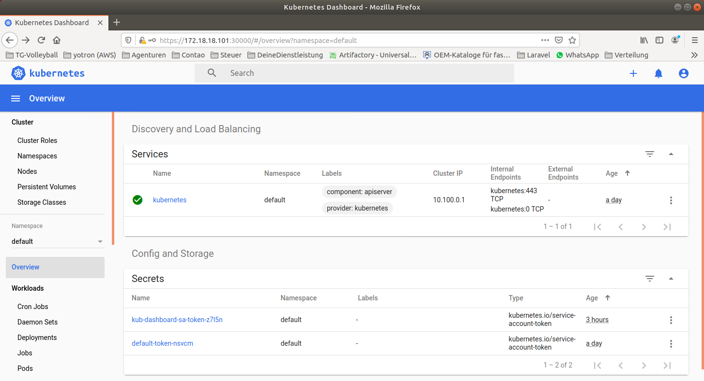

#  [](http://www.yotron.de)

[YOTRON](http://www.yotron.de) is a consultancy company which is focused on DevOps, Cloudmanagement and 
Data Management with NOSQL and SQL-Databases. Visit us on [ www.yotron.de ](http://www.yotron.de)

# Local Kubernetes Cluster
With this project you can deploy a simple Kubernetes cluster with one master and two nodes in a base configuration. 
But you can deploy as much nodes you wants (or your host machine is able too run).

This Kubernetes Deployment based purely on kubectl manifests. No kubeadmin tasks and no helm scripting. The complete
setup is also pure Ansible. No scripting with uploaded Shellscript, only configuration in Ansible. This is perhaps the most 
pure Kubernetes setup of a local Kubernetes cluster in GitHub.   

The deployment based on Vagrant with Virtualbox and Ansible. 

The base setup contains only a base configuration for a cluster. 
Pods are only available for Calico and the Kubernetes Dashboard.

The base configuration is in file `ansible/kubernets/files/kubeconfig` defined. 
Feel free to change the configuration.

```
apiVersion: v1
kind: Config
clusters:
- name: local
  cluster:
    server: http://172.18.18.101:8080
users:
- name: kubelet
contexts:
- context:
    cluster: local
    user: kubelet
  name: kubelet-context
current-context: kubelet-context
```

You have the full control of all of the versions you want to use:
- SetUp is independent from a Package Management like yum, apt-get
- Save for restart of complete Kubernetes

The installation process contains 
- etcd service as a clustered key/value store (https://etcd.io/)
- docker-service (https://www.docker.com/)
- kubernetes services (https://kubernetes.io/)
  - kubelet
  - kube-apiserver
  - kube-controller-manager
  - kube-proxy
  - kube-scheduler
  
Additional Controller which will be installed are 
- Calico for the network and policy controlling (https://www.projectcalico.org/)
- [Kubernetes Dashboard](https://kubernetes.io/docs/tasks/access-application-cluster/web-ui-dashboard/) 

### Requirements 
- Vagrant (https://www.vagrantup.com/), tested with version 2.2.4
- Oracle Virtual Box (https://www.virtualbox.org/), tested with Version 5.2.34
- Ansible Version (https://www.ansible.com/), tested with Version 2.9.2


### Startup
To start the Cluster an install all necessary components:

`whoiami@mymachine:~$ vagrant up`

The following node will be created:

- *k8s-master*

- *k8s-node-01*

- *k8s-node-02*

The start process begins with the Nodes and afterwards the master will be created.

Please be aware that ist tooks some time after the start of the vagrant host to get to the Kubernetes Dashboard. 

Here are somme calls for checking the proper setup. 

### Checks

Please check the startup of the nodes and pods.

Login to *k8s-master* via Vagrant  :

`whoami@mymachine:~$ vagrant ssh k8s-master`

```
vagrant@k8s-master:~$ kubeeyJhbGciOiJSUzI1NiIsImtpZCI6InVHUTdKaHgtcmNIVEpmaGUyT0pjZjA1VjJhS05oUG95NmRDb1RGWGlhWEEifQ.eyJpc3MiOiJrdWJlcm5ldGVzL3NlcnZpY2VhY2NvdW50Iiwia3ViZXJuZXRlcy5pby9zZXJ2aWNlYWNjb3VudC9uYW1lc3BhY2UiOiJkZWZhdWx0Iiwia3ViZXJuZXRlcy5pby9zZXJ2aWNlYWNjb3VudC9zZWNyZXQubmFtZSI6ImRhc2hib2FyZC1hZG1pbi1zYS10b2tlbi1waDl0cyIsImt1YmVybmV0ZXMuaW8vc2VydmljZWFjY291bnQvc2VydmljZS1hY2NvdW50Lm5hbWUiOiJkYXNoYm9hcmQtYWRtaW4tc2EiLCJrdWJlcm5ldGVzLmlvL3NlcnZpY2VhY2NvdW50L3NlcnZpY2UtYWNjb3VudC51aWQiOiJmYzgxNzU0MC00YjhhLTQ2OWQtYjcxYy04NzdlYzU4N2U2ZTkiLCJzdWIiOiJzeXN0ZW06c2VydmljZWFjY291bnQ6ZGVmYXVsdDpkYXNoYm9hcmQtYWRtaW4tc2EifQ.TVC_jPSE4CNNlWVgHuMu5W8I7F7lmVXNftqzFHb5X3XVH_Pdj28nhItkrbZIZKxo2WOrlr_ypI59Tu2g1gR4nI19Og4NllVepRTYReKD-IHsfjgi3z9iHMx-QW_X5IIvFN76C5OuAHSFqqk6B1teUjNtrOeQdlAk6jMLtttfO8pc72dx1ksXtFvVloVjvrcXkWt0UbwLcqA-3etkj06WpMuFpRVtDUo3ArZYl94WcGyun_5zDPY1NfLJGbfLQjFABP2dtmYAm30GLDq9pXYnFgctl get nodes
NAME            STATUS                     ROLES    AGE     VERSION
172.18.18.101   Ready,SchedulingDisabled   <none>   6m17s   v1.17.0
172.18.18.102   Ready                      <none>   6m16s   v1.17.0
172.18.18.103   Ready                      <none>   6m19s   v1.17.0
```
```
vagrant@k8s-master:~$ kubectl get pods --all-namespaces
NAMESPACE              NAME                                         READY   STATUS    RESTARTS   AGE
kube-system            ### Checkscalico-kube-controllers-648f4868b8-62tcc     1/1     Running   0          3m33s
kube-system            calico-node-clncb                            1/1     Running   0          3m33s
kube-system            calico-node-z4m26                            1/1     Running   0          3m33s
kube-system            calico-node-z4pnn                            1/1     Running   0          3m33s
kubernetes-dashboard   dashboard-metrics-scraper-76585494d8-lbvmq   1/1     Running   0          3m33s
kubernetes-dashboard   kubernetes-dashboard-5996555fd8-l6hbj        1/1     Running   0          3m33s
```

Dashboard URL

`https://172.18.18.102:30000/`

### Authenticate against the Kubernetes Dashboard

- the lazy way:

  Just select `skip`. It is clear, that this environment is only usable for looking and testing not for production.
  
- the not so lazy way:
 
  The Dashboard has an own ServiceAccount with which you can authentication against the Dashboard. 
  To get a token for Authentication:
  
  Login to *k8s-master* via Vagrant  
  `whoami@mymachine:~$ vagrant ssh k8s-master`
  
  ```
  vagrant@k8s-master:~$ kubectl -n kubernetes-dashboard get secrets
  NAME                               TYPE                                  DATA   AGE
  default-token-9l272                kubernetes.io/service-account-token   3      2m30s
  kubernetes-dashboard-certs         Opaque                                0      2m30s
  kubernetes-dashboard-csrf          Opaque                                1      2m30s
  kubernetes-dashboard-key-holder    Opaque                                2      2m30s
  kubernetes-dashboard-token-28bfn   kubernetes.io/service-account-token   3      2m30s
  ```
  Please look for the secret with name `kubernetes-dashboard-token-...`. This is the service account you can use for the
  authentication against the dashboard.
  
  Get the secret token: 
  ```
  vagrant@k8s-master:~$ kubectl -n kubernetes-dashboard describe  secret kubernetes-dashboard-token-28bfn
  Name:         kubernetes-dashboard-token-28bfn
  Namespace:    kubernetes-dashboard
  Labels:       <none>
  Annotations:  kubernetes.io/service-account.name: kubernetes-dashboard
              kubernetes.io/service-account.uid: fbfdf673-8c87-41ad-9d09-cdca7e37f4ec
  Type:  kubernetes.io/service-account-token
  Data
  ====
  ca.crt:     2286 bytes
  namespace:  20 bytes
  token:      eyJhbGciOiJSUzI1NiIsImtpZC<This is a very long string>z-Dq3VRYD87kDkjW-CBxMl_L-7NOva31k8QBC2A
  ```
  
  The Parameter `token` contains the token for Authentication against the Kubernetes Dashboard. Just Copy/Paste into the token area.
  
  
  
  Welcome to the Kubernetes Dashboard.
  
  

### own credentials
created by [Joern Kleinbub](https://github.com/joernkleinbub), YOTRON, 03.01.2020

Vist me at [LinkedIn](https://www.linkedin.com/in/j%C3%B6rn-kleinbub/) 

Or via EMail <joern.kleinbub@yotron.de>, www.yotron.de